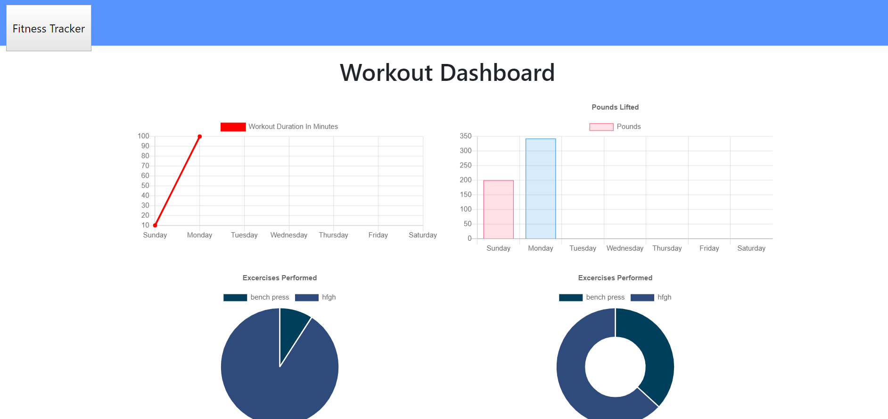

# Workout Tracker

As a user, I want to be able to view create and track daily workouts. I want to be able to log multiple exercises in a workout on a given day. I should also be able to track the name, type, weight, sets, reps, and duration of exercise. If the exercise is a cardio exercise, I should be able to track my distance traveled.

## Instructions:

   1. Click on "New Workout" or "Continue Workout".
   2. "New" will allow you to add a new exercise.  Click complete when you are done.
   3. "Continue" will allow you to add to your most recent exercise program.  Click complete   when you are done.
   4. Click on "Dashboard" to see your progress "Stats".
   5. Click on "Fitness Tracker" to go back to the main page.
   
## Installation: 

   npm install

